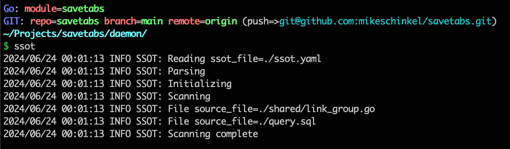

# ssot

SSOT: Single Source Of Truth command line utility

## Overview
SSOT stores a single source of truth for constant values in an `./ssot.yaml` file that contains a list of constants and a list of files to processes.

SSOT directives are comments in the native language and replacements are done _"inline."_

Directives are end-of-line comments that contain a named constant to replace, and a regexp to allow direct matching of content within the line. Matching identifies the content in the line that `ssot` will replace with the constant's value from the `Constants` map in  `./ssot/yaml`.

The regex can — but is not required to — have begin (`^`) and end (`$`) of line anchors but only one capture group (`(...)`) which should identify the value to replace.

## Benefits 
Why use `ssot`?  Here are the benefits I was after when I chose to develop and start using it:

1. Allow structured documentation via directives for locations in source where constants are shared across language files.
2. Enable error checking for all directives to ensure correct syntax and ease of modification.
3. When there is a need to change values, facilitate changing the values in one place.
4. Alternately allow the constants to be renamed easily and accurately via editor search.

## Usage 
Store a `ssot.yaml` file in whatever directory you want to maintain your constants with a `Files` array and a `Constants` map, e.g.:

```yaml
---
files:
    - ./shared/link_group.go
    - ./query.sql

extensions:
    .go: //
    .sql: --

constants:
    from_group_missing:      "from_group_missing"
    link_missing:            "link_missing"
    to_group_found:          "to_group_found"
```

Then in your source files use an end-of-line comment in the form of:

```
ssot[<constant>]: <regex>
```

### Example .GO file:

```go
package shared

const (
	FromGroupMissing     = "from_group_missing"       //ssot[from_group_missing]: "([^"]+)"
	LinkMissing          = "link_missing"             //ssot[link_missing]: "([^"]+)"
	ToGroupFound         = "to_group_found"           //ssot[to_group_found]: "([^"]+)"
)
```
Finally, run `ssot` in the directory where your `ssot.yaml` file exists.



### Example .SQL file:

```sql
SELECT
   'link_missing' AS exception, --ssot[link_missing]: '([^']+)'
   from_group_id,
   from_group_name,
   link_id,
   link_url,
   to_group_id,
   to_group_name
FROM
   link_group_move_from_to
WHERE
   link_found = 0
UNION
SELECT
   'from_group_missing' AS exception, --ssot[from_group_missing]: '([^']+)'
   from_group_id,
   from_group_name,
   link_id,
   link_url,
   to_group_id,
   to_group_name
FROM
   link_group_move_from_to
WHERE
   from_group_found = 0
UNION
SELECT
   'to_group_found' AS exception, --ssot[to_group_found]: '([^']+)'
   from_group_id,
   from_group_name,
   link_id,
   link_url,
   to_group_id,
   to_group_name
FROM
   link_group_move_from_to
WHERE
   to_group_found = 0;
```

## Goals
The current goals for this project:

1. In-place updates of files; no _"src (e.g. `.ts`)"_ vs. _"dst (e.g. `.js`)"_ files.
2. Performance first
    - Instead of scanning all files, require developer to specify the files to scan 
3. Start simple, keep it as simple, only adding complexity when really required.
4. Do not implement anything more than I _(or maybe someone else)_ currently need(s).

## Rationale
Written to scratch my own itch. I wanted to have a single-source of truth across different source files from different programming languages, but I did not want to have a `source -> dist` build step given the nature of the `truth` being small compared to the size of the code the truth is typically embedded in. 

## Known Limitations
1. Currently only one named constant can be replaced per line, but a constant can be referenced multiple times in the same line, if needed _(this is assumed but untested.)_
2. No command line options so no execution options.
3. No versioning yet; use latest and caveat emptor. 
4. No tests _(yet)_ as I didn't really need for my simply use-case.


## Bug Reports and Pull Requests
...are **Welcome!**  

If you find this and it is useful for you but you discover bugs or have improvements to add, please feel free to create a bug report and/or a pull request.   

## Copyright
Copyright 2024 Mike Schinkel

## License 
MIT
